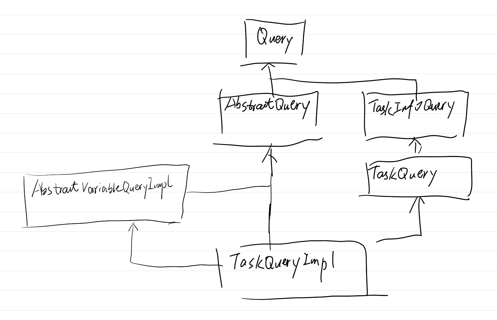
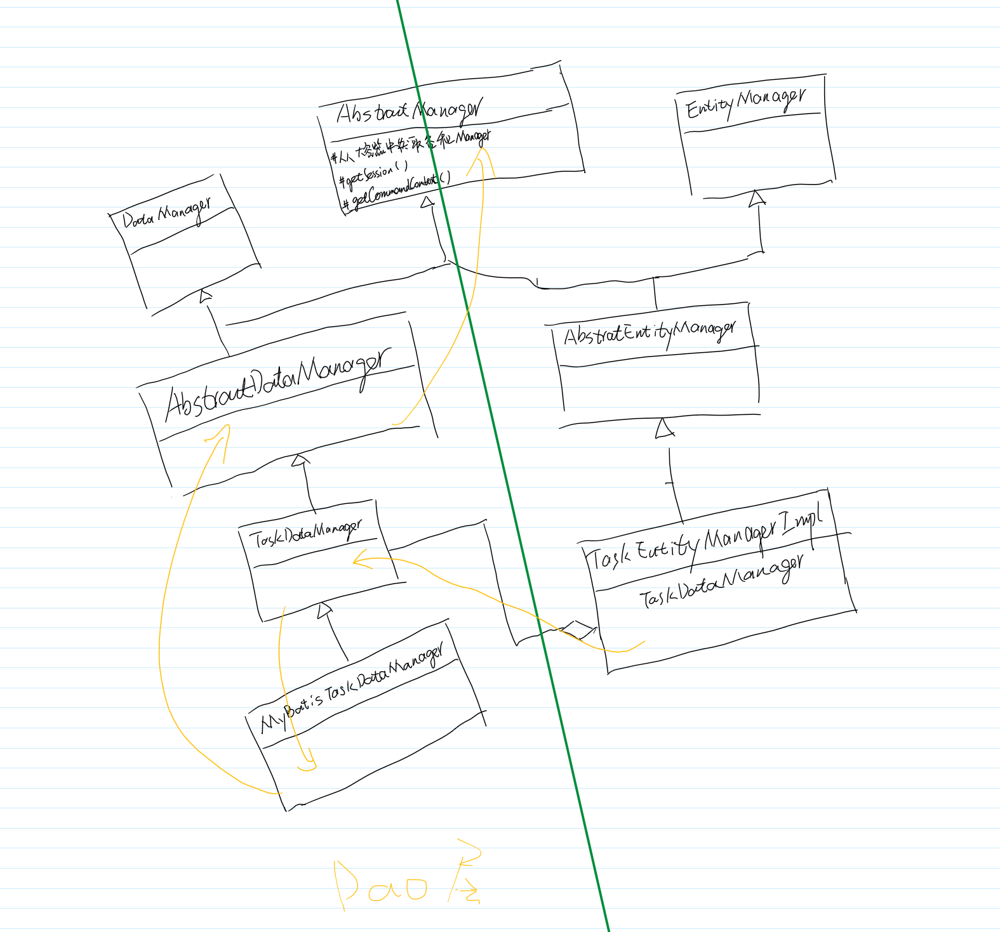
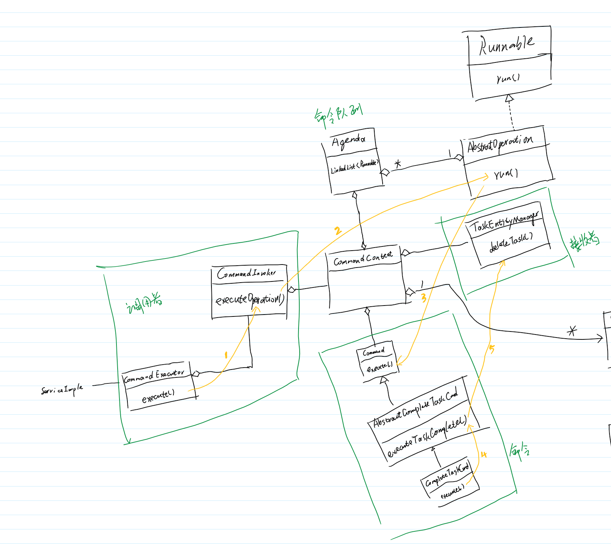

# Query
## TaskQuery
整个`Query`系统可以分成三层。最顶层的是`Query`，中间是`AbstractQuery`、类似`TaskQuery`特定化的某个Query，最底层是类似`TaskQueryImpl`一样的具体实现类。

`Query`中定义的是查询的最基本操作**排序**、**返回列表**、**返回个数**、**分页**。

`AbstractQuery`实现`Query`的方法，但是它无法完全实现，主要是定义一个模板方法，留一个未实现的钩子方法给具体的实现类来实现。

最底层的就以`TaskQueryImpl`举例说明，实现`AbstractQuery`中的`executeList()`和`executeCount()`方法，还`Task`相关的中间层的方法。

`AbstractVariableQueryImpl`完了再写

# Manager

# 命令模式

