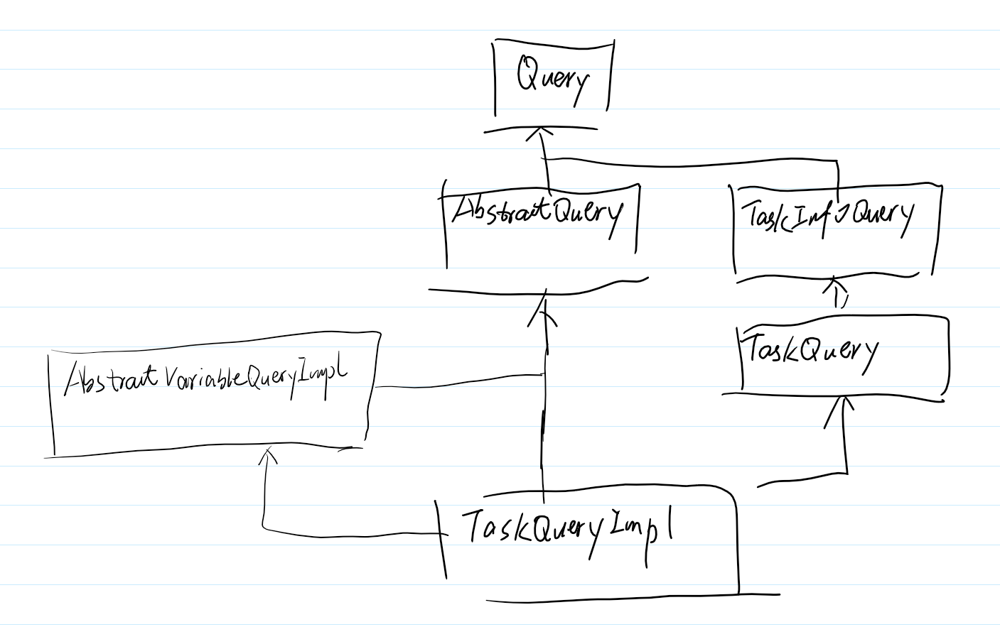
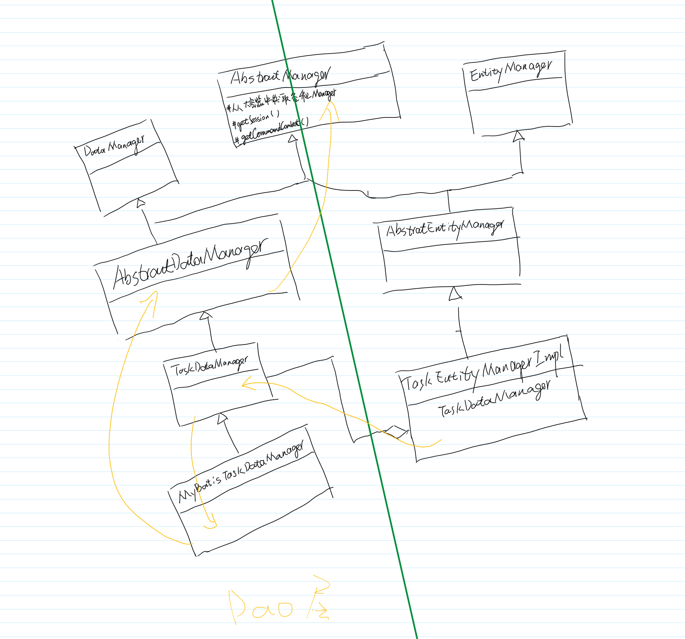
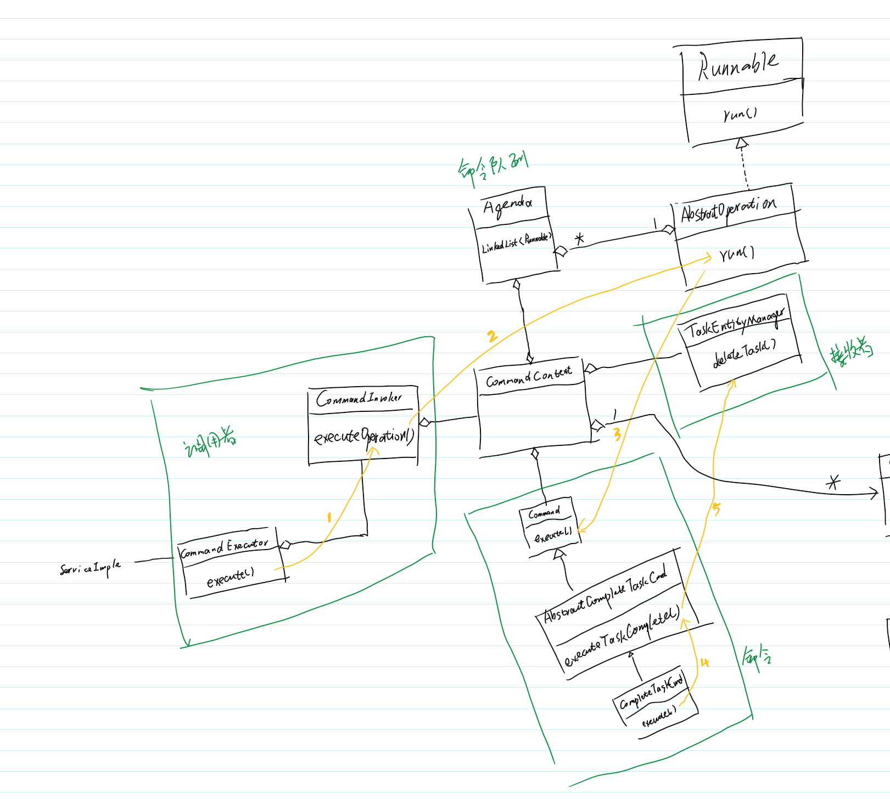

# Query
## TaskQuery
整个`Query`系统可以分成三层。最顶层的是`Query`，中间是`AbstractQuery`、类似`TaskQuery`特定化的某个Query，最底层是类似`TaskQueryImpl`一样的具体实现类。

`Query`中定义的是查询的最基本操作**排序**、**返回列表**、**返回个数**、**分页**。

`AbstractQuery`实现`Query`的方法，但是它无法完全实现，主要是定义一个模板方法，留一个未实现的钩子方法给最底层的实现类来实现。

最底层的就以`TaskQueryImpl`举例说明，实现`AbstractQuery`中的`executeList()`和`executeCount()`方法，还`Task`相关的中间层的方法。

## AbstractVariableQueryImpl
`AbstractVariableQueryImpl`完了再写




# 持久化
所有的CRUD最后的操作会送到对应的Manager中。

以Task举例，最后的命令执行会到`TaskEntityManagerImpl`中，`TaskEntityManagerImpl`聚合了`TaskDataManager`，具体的执行会通过`TaskDataManager`的子类`MybatisTaskDataManager`来实现，而`MybatisTaskDataManager`的做法是通过父类`AbstractDataManager`的`getDbSqlSession()`方法获取到`DbSqlSession`来进行最后的操作。


DbSqlSession是在放在CommandContext中的，最后是通过AbstractManager中的getSession获取的，

这玩儿可以理解成成分层设计，就像web项目中的service层和dao层。



# 命令模式




# ProcessEngineConfigurationImpl


在Spring Boot应用中，可以使用**AOP（Aspect-Oriented Programming）**来实现所有方法在执行前和执行后自动打印日志。Spring AOP允许你通过编写切面（Aspect）来拦截方法调用，执行一些额外的操作，比如打印日志。

下面是一个完整的实现步骤，展示如何使用**SLF4J**结合Spring AOP来实现这一功能。

### 1. 添加依赖

首先，确保你在`pom.xml`中已经包含了Spring AOP和SLF4J的依赖：

```xml
<dependencies>
    <!-- SLF4J日志依赖 -->
    <dependency>
        <groupId>org.slf4j</groupId>
        <artifactId>slf4j-api</artifactId>
        <version>1.7.36</version>
    </dependency>
    <dependency>
        <groupId>org.slf4j</groupId>
        <artifactId>slf4j-log4j12</artifactId>
        <version>1.7.36</version>
    </dependency>
    
    <!-- Spring AOP依赖 -->
    <dependency>
        <groupId>org.springframework.boot</groupId>
        <artifactId>spring-boot-starter-aop</artifactId>
    </dependency>
</dependencies>
```

### 2. 定义日志切面类

创建一个`LoggingAspect`类，在这个类中定义执行前后的日志逻辑。

```java
import org.aspectj.lang.JoinPoint;
import org.aspectj.lang.annotation.After;
import org.aspectj.lang.annotation.AfterReturning;
import org.aspectj.lang.annotation.Aspect;
import org.aspectj.lang.annotation.Before;
import org.slf4j.Logger;
import org.slf4j.LoggerFactory;
import org.springframework.stereotype.Component;

@Aspect
@Component
public class LoggingAspect {

    // 定义日志记录器
    private static final Logger logger = LoggerFactory.getLogger(LoggingAspect.class);

    // 定义前置通知，方法执行前调用
    @Before("execution(* com.example.yourpackage..*(..))")  // 替换为你的包路径
    public void logBeforeMethodExecution(JoinPoint joinPoint) {
        // 获取方法名称并打印日志
        String methodName = joinPoint.getSignature().getName();
        logger.info("Method {} is about to be executed", methodName);
    }

    // 定义后置通知，方法执行后调用
    @AfterReturning(pointcut = "execution(* com.example.yourpackage..*(..))", returning = "result")
    public void logAfterMethodExecution(JoinPoint joinPoint, Object result) {
        String methodName = joinPoint.getSignature().getName();
        logger.info("Method {} executed successfully with result: {}", methodName, result);
    }

    // 如果你还想记录异常情况，可以使用@AfterThrowing
    @After("execution(* com.example.yourpackage..*(..))")
    public void logAfterMethodThrows(JoinPoint joinPoint) {
        String methodName = joinPoint.getSignature().getName();
        logger.info("Method {} threw an exception", methodName);
    }
}
```

#### 解释：
- `@Aspect`: 表示该类是一个切面类。
- `@Component`: 将该类声明为Spring Bean，以便自动注入。
- `@Before`: 在方法执行前运行，可以在这里打印方法名称。
- `@AfterReturning`: 在方法成功执行并返回后运行，可以在这里打印方法返回结果。
- `execution(..)`: 这是切点表达式，表示要拦截的包路径和方法，`com.example.yourpackage..*(..)`表示拦截该包下的所有方法。

### 3. 启用AOP

在Spring Boot应用中，Spring AOP默认是启用的，如果你已经添加了`spring-boot-starter-aop`依赖，Spring会自动扫描并启用切面。如果没有启用，可以通过配置类或注解手动启用：

```java
import org.springframework.boot.SpringApplication;
import org.springframework.boot.autoconfigure.SpringBootApplication;
import org.springframework.context.annotation.EnableAspectJAutoProxy;

@SpringBootApplication
@EnableAspectJAutoProxy // 启用AspectJ自动代理
public class YourSpringBootApplication {

    public static void main(String[] args) {
        SpringApplication.run(YourSpringBootApplication.class, args);
    }
}
```

### 4. 运行效果

当你运行应用程序并调用任何被拦截的方法时，日志会自动打印：
- 在方法执行之前，打印"Method [methodName] is about to be executed"
- 在方法执行成功并返回结果后，打印"Method [methodName] executed successfully with result: [result]"

### 5. 可选扩展
你可以根据需要扩展日志功能，例如：
- 记录方法的入参 (`joinPoint.getArgs()`)
- 记录执行时间 (`System.currentTimeMillis()`)
- 处理异常日志 (`@AfterThrowing`)

这是最常见的做法之一，可以为项目中的所有方法执行提供统一的日志记录。如果有特定的方法或类需要跳过日志记录，可以进一步调整切点表达式。